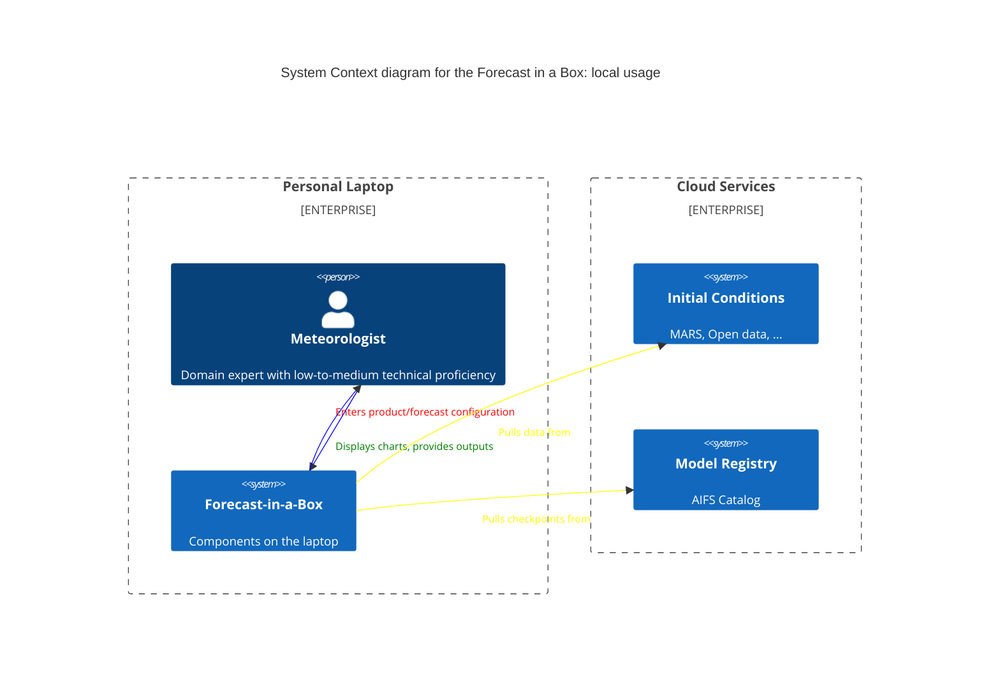
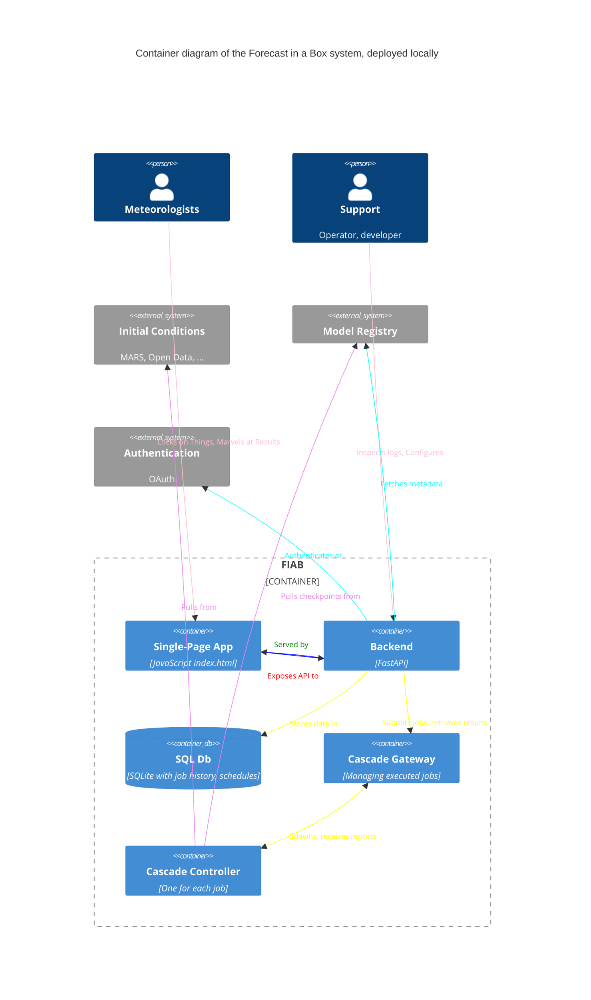

# C4 Diagrams

Note: for HPC cluster usage, the only difference would be of Forecast-in-a-Box system living wholly on
a cluster, but system-wise all relationships and other boundaries remain the same.

Note: the difference between local and cluster deployments is just in whether the containers are all co-located, or live at different machines.
In principle, there is no co-locality requirement whatsoever.
